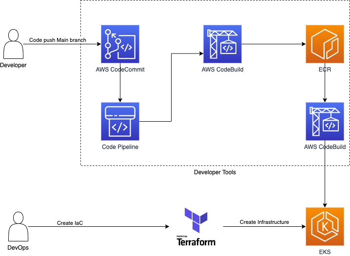

# CI/CD of Java app to EKS created with Terraform using AWS Developers tool


## Create EKS using Terraform
1.1 Create new VPC and private and public subnets

1.2 Create Load balancer

1.3 Create aws-auth configmap

1.4 Create cluster

1.5 Create kubernetes deployment and service

### Terraform Commands 
- ```terraform init``` - Initialize terraform
- ```terraform validate``` - Check the configuration is valid
- ```terraform plan``` - Show changes required by the current configuration
- ```terraform apply``` - Create or update infrastructure
- ```terraform destroy``` - Destroy previously-created infrastructure


## Continuous Deployment to EKS using AWS Developer tool
2.1 Create java application

2.2 Push to AWS Codecommit

2.3 CodePipeline: From git repository to Container Registry
 - Developer push new code to main branch CodeBuild will trigger and create docker image and push to ECR

2.4 CodePipeline: From ECR to EKS
 - New docker image pushed in ECR then Codebuild will trigger deploy to EKS cluster

### Need to improve.
- Create Codecommit, Codebuild, Codepipeline in Terraform.

